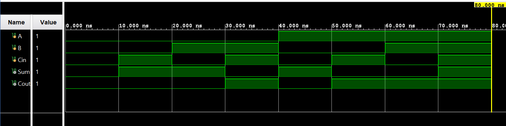

# Full Adder

## What is a Full Adder?

A Full Adder is a combinational circuit that adds three 1-bit binary inputs.

It has:
- 3 inputs: A, B, and Cin (Carry-in)
- 2 outputs: Sum and Cout (Carry-out)

Unlike a Half Adder, a Full Adder can accept a carry from a previous addition through the `Cin` input.

## Truth Table

| A | B | Cin | Sum | Cout |
|---|---|-----|-----|------|
| 0 | 0 |  0  |  0  |  0   |
| 0 | 0 |  1  |  1  |  0   |
| 0 | 1 |  0  |  1  |  0   |
| 0 | 1 |  1  |  0  |  1   |
| 1 | 0 |  0  |  1  |  0   |
| 1 | 0 |  1  |  0  |  1   |
| 1 | 1 |  0  |  0  |  1   |
| 1 | 1 |  1  |  1  |  1   |

## Boolean Expressions

### Sum
Sum = A XOR B XOR Cin

### Carry Output
Cout = AB + Cin(A XOR B)

## Verilog Implementation

The circuit is implemented using continuous assignments:

- `Sum = A ^ B ^ Cin `
- ``Cout = (A & B) | (Cin & (A ^ B ))`

# Testbench

The testbench checks all eight possible combinations of inputs:

000, 001, 010, 011, 100, 101, 110, 111

The simulation output matches the expected truth table.

Behavioral simulation was performed in Vivado 2024.1.
