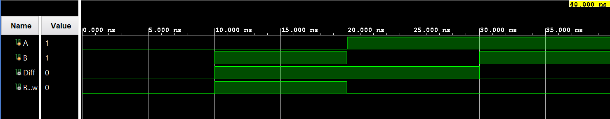

# Half Subtractor

## What is a Half Subtractor?

A Half Subtractor is a combinational circuit that subtracts two 1-bit binary inputs.

It has:
- 2 inputs: A, B
- 2 outputs: Difference and Borrow

## Truth Table

| A | B | Diff| Bor |
|---|---|-----|-----|
| 0 | 0 |  0  |  0  |
| 0 | 1 |  1  |  1  |
| 1 | 0 |  1  |  0  | 
| 1 | 1 |  0  |  0  |

## Boolean Expressions

### Difference
Diff = A XOR B 

### Borrow
Borrow = ~A AND B

## Verilog Implementation

The circuit is implemented using continuous assignments:

- `Difference = A ^ B `
- `Borrow = A' & B`

# Testbench

The testbench checks all four possible combinations of inputs:

00, 01, 10, 11

The simulation output matches the expected truth table.

Behavioral simulation was performed in Vivado 2024.1.
