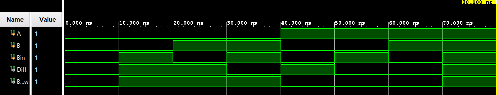

# Full Subtractor

## What is a Full Subtractor?

A Full Subtractor is a combinational circuit used to subtract two 1-bit binary numbers while also taking a borrow from a previous subtraction.

It has:

* 3 inputs: A, B, and Bin (Borrow-in)
* 2 outputs: Difference and Borrow (Borrow-out)

The subtraction performed is:

**A - B - Bin**

## Truth Table

| A | B | Bin | Diff | Borrow |
| - | - | --- | ---- | ------ |
| 0 | 0 | 0   | 0    | 0      |
| 0 | 0 | 1   | 1    | 1      |
| 0 | 1 | 0   | 1    | 1      |
| 0 | 1 | 1   | 0    | 1      |
| 1 | 0 | 0   | 1    | 0      |
| 1 | 0 | 1   | 0    | 0      |
| 1 | 1 | 0   | 0    | 0      |
| 1 | 1 | 1   | 1    | 1      |

## Boolean Expressions

### Difference

```text
Diff = A XOR B XOR Bin
```

### Borrow

```text
Borrow = A'B + A'Bin + BBin
```

## Verilog Implementation

The Full Subtractor is implemented using continuous assignments:

```verilog
assign Diff = A ^ B ^ Bin;
assign Borrow = (~A & B) | (~A & Bin) | (B & Bin);
```

## Testbench

The testbench checks all 8 possible combinations of the three inputs:

```text
000
001
010
011
100
101
110
111
```

The simulation output is compared against the expected truth table.

## Simulation

Behavioral simulation was performed using Vivado 2024.1.


